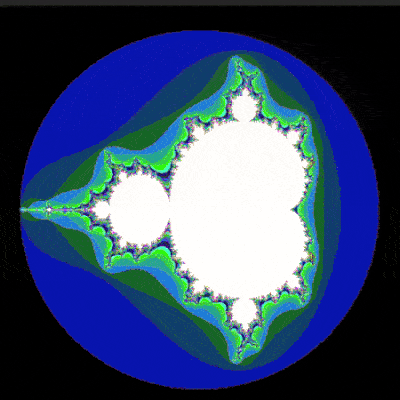
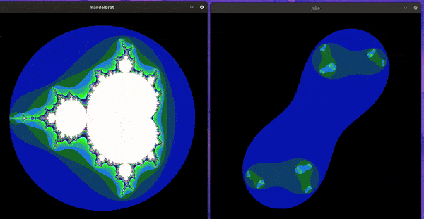
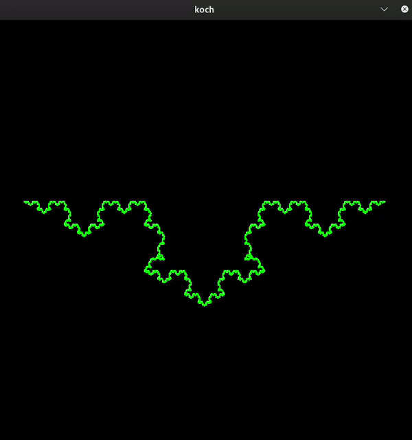

  

<h2> 🏁 Goals </h2>

- Create a basic computer graphics project, 3 types of fractal Mandelbrot Set, Julia set and Koch curve!

- This has a opportunity to get familiar with the graphics libraries, to discover or use the mathematical notion of complex numbers, to take a peek at the concept of optimization in computer graphics and practice event handling.

 <h2>MiniLibX</h2>
 
- This library was developed internally and includes basic necessary tools to open a window, create images and deal with keyboard and mouse events.

  

 <h2>Mandelbrot</h2>
 
 

 <h2>Mandelbrot and Julia interactions</h2>
 
 

 <h2>Koch</h2>
 
 
